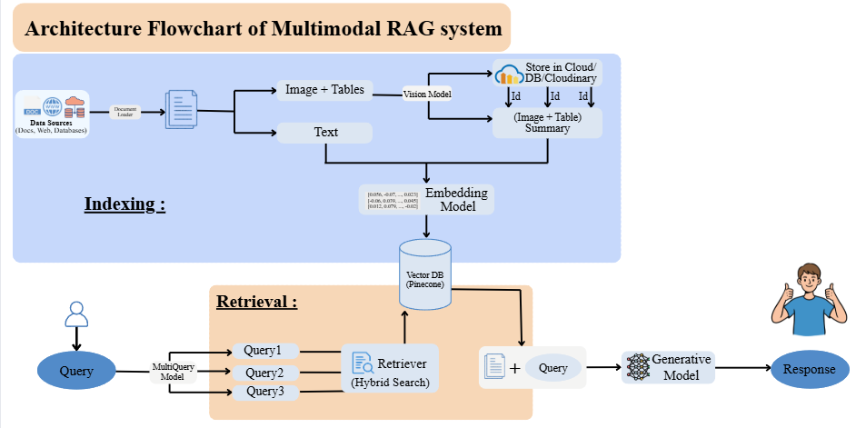
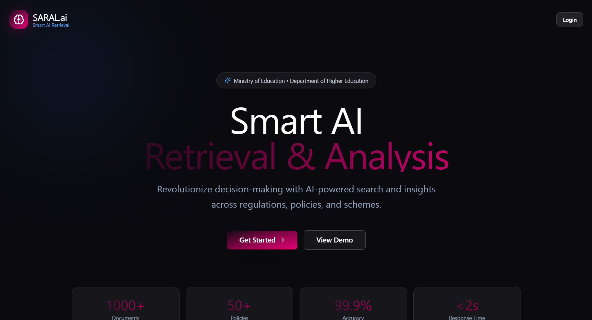
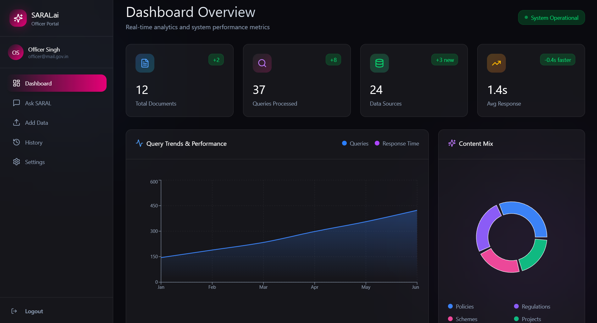
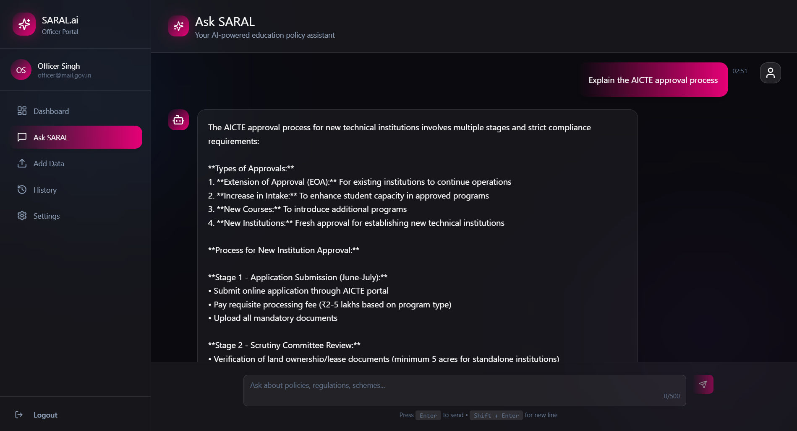

# SARAL.ai

** Demo Link :- ** https://saralai.vercel.app/

This is a **RAG (Retrieval-Augmented Generation)** based prototype application for creating a common knowledge base for Ministry of Education and related organizations from their various documents, rules, regulations, and large databases.

Hence,
- automating the document retrieval process
- reducing the delays due to retrieval of documents
- faster decision making and reduction in loss of man-power in this process
- identification & resolution of conflicting rules, regulations among different organizations
- references for each response to ensure credibility and guard-railing the models

## Tech Stack :-
React.JS, FastAPI, Cloudinary, LangChain, ChromaDB, Gemini-2.5 API and Sentence-Transformers Embeddings Model for embeddings

## Architecture of our RAG system :-

## UI Images :-

  
  
  

